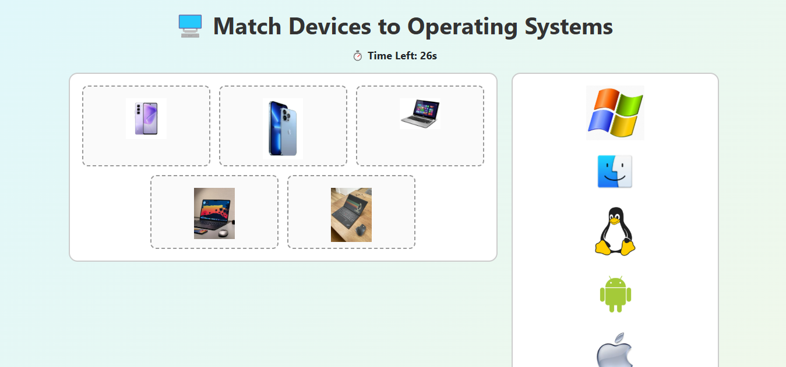
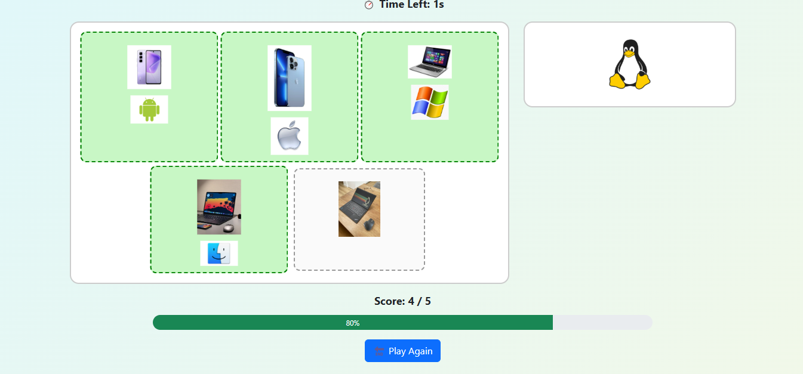
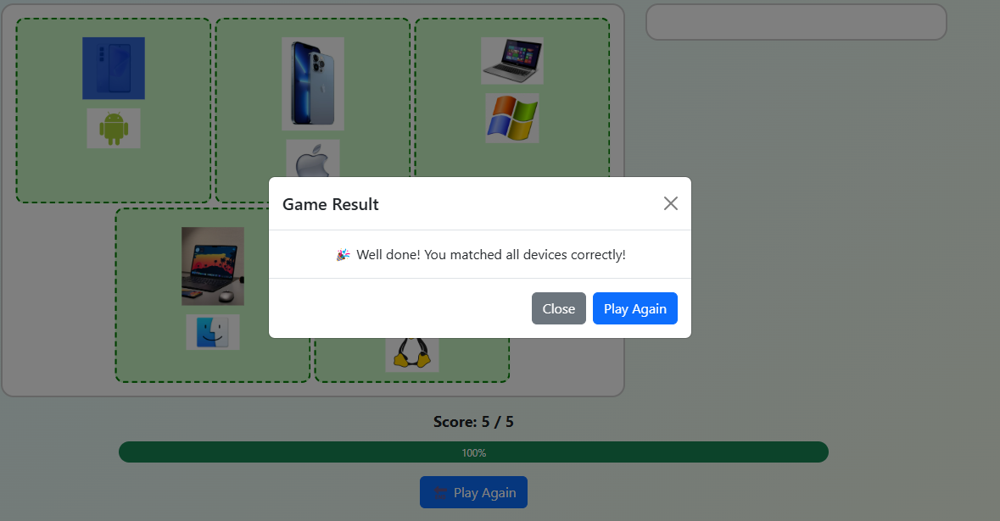

# 🖥️ OS Matching Game  

An interactive **drag-and-drop game** built with **HTML, CSS, JavaScript, and Bootstrap** to help pupils learn and test their understanding of **Operating Systems** and the devices they run on.  

---

## 📖 Story Behind the Project  
While preparing lesson notes for my pupils on **Operating Systems**, I wanted the class activity to be more engaging than a simple worksheet.  
So, I built this **mini web game** to make learning fun and interactive.  

Instead of memorizing, pupils can now **play and learn**, matching devices (phones, laptops, tablets, desktops, smartwatches) with the correct Operating Systems (Android, iOS, Windows, macOS, Linux).  

---

## 🎮 How to Play  
- Drag an **OS logo** and drop it onto the correct **device**.  
- ✅ Correct matches stick, add to the score, and show success animations.  
- ❌ Wrong matches bounce back with feedback.  
- A **30-second timer** keeps things exciting.  
- A **progress bar** shows your completion status.  
- At the end, a **congratulations modal** appears with:
  - 🏆 Best Score (all-time high score).  
  - 🎯 Last Score (previous attempt).  
- Hit **Reset** to reshuffle devices and logos for a new game.  

---

## 🛠️ Built With  
- **HTML5** – Structure of the game.  
- **CSS3** – Styling, animations, and effects.  
- **JavaScript (Vanilla)** – Drag-and-drop logic, scoring system, timer, and reset functionality.  
- **Bootstrap 5** – Responsive layout, progress bar, and modal for results.  

---

## 🚀 Live Demo  
👉 [Play the Game Here](https://thecomputerixed.github.io/os-matching-game/)  
 

---

## 📂 Project Structure  
os-matching-game/
│── index.html # Main game file
│── images/ # Device & OS logo images
│ ├── phone.jpeg
│ ├── iphone.jpeg
│ ├── laptop.jpeg
│ ├── macbook.jpeg
│ ├── linux.jpeg
│ ├── android.jpeg
│ ├── ios.jpeg
│ ├── windows.jpeg
│ ├── macos.jpeg
│ ├── linuxos.jpeg

---

## 📸 Screenshots  

### Game Start  

 

### Correct Match  

### Congratulations Modal  
 

---

## ✨ Why This Project?  
This project shows how **education + code** can create **fun learning experiences**.  
It’s not just a game — it’s a teaching aid that helps pupils engage with ICT concepts in an interactive way.  

---

## 💡 Future Improvements  
- Add more devices & OS (e.g., ChromeOS, HarmonyOS).  
- Include multiple difficulty levels.  
- Add sound toggle option for classroom use.  
- Make it multiplayer (two pupils racing against the timer).  

---

## 📜 License  
This project is open-source and free to use for **educational purposes**.  

---

